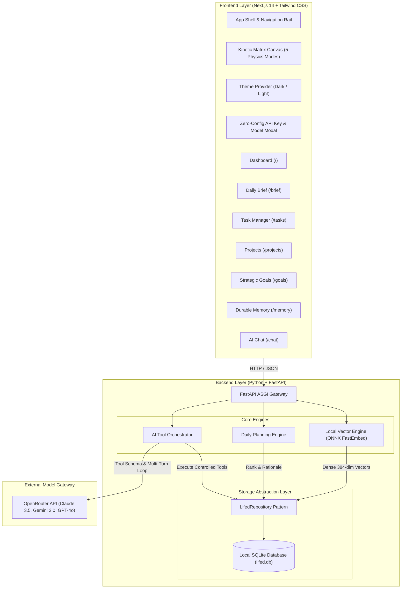

# Lifed — Personal AI Command Center

[](https://nextjs.org/)
[](https://fastapi.tiangolo.com/)
[](https://www.sqlite.org/)
[](https://openrouter.ai/)
[](LICENSE)

**Lifed** is a lightweight, personal-first AI command center and decision-support operating system. It connects high-level strategic goals, actionable projects, tasks, deadlines, and durable semantic memory, synthesizing this context through an autonomous tool-calling AI orchestrator and an intelligent daily planning engine.

The visual interface is built with an interactive **Kinetic Matrix** particle lattice that responds to pointer physics, supports 5 context-adaptive rendering modes, and transitions between monochrome Dark and Light themes in real time.

---

## The Core Loop

```
Understand → Remember → Plan → Decide → Execute → Learn
```

1. **Understand**: Synthesizes tasks, project relationships, upcoming deadlines, and goal progress into an actionable Command Center.
2. **Remember**: Stores user preferences, routines, constraints, and working facts locally using on-device dense vector embeddings (zero cloud leaks).
3. **Plan**: Deterministically ranks pending tasks by urgency, importance, and goal impact, scheduling time blocks that honor individual working styles.
4. **Decide**: Evaluates trade-offs and generates explicit, data-backed rationale explaining why tasks are ordered the way they are.
5. **Execute**: Invokes approved tools to create, update, and manage tasks, goals, and durable memory records directly through natural language.
6. **Learn**: Adapts subsequent planning cycles as constraints change, tasks complete, or new user preferences are recorded.

---

## System Architecture



---

## Key Features

### 1. Interactive Kinetic Matrix Visual System
- **HTML5 Canvas physics**: Drifting particle lattice, distance-based tension strands, traveling synaptic pulses, and elastic pointer shockwaves.
- **5 Context-Aware UI Modes**:
  - `Ambient`: Full visual density and interactive shockwaves for the Command Center Dashboard.
  - `Focus`: Quieted grid, reduced drift, and disabled shockwaves on data-dense screens (Tasks, Projects, Goals, Memory) for distraction-free reading.
  - `Conversational`: Low-opacity edge treatment for AI Chat, pulsing during model reasoning.
  - `Reduced-Motion`: Static lattice disabling all continuous motion and pointer repulsion in compliance with accessibility standards.
  - `Compact`: Adaptive grid density for mobile and tablet screens.
- **Theme-Aware Physics**: Adapts canvas background, node points, connecting strands, and pulse glow colors between Dark and Light modes without reloading.

### 2. Autonomous Tool Calling Engine
Lifed exposes 8 controlled tool functions to the LLM:
- `create_task(title, priority, estimated_duration, deadline, notes)`
- `get_tasks(status, priority)`
- `update_task(task_id, status, priority, deadline)`
- `create_goal(title, description)`
- `get_goals(status)`
- `save_memory(content, type)`
- `search_memory(query)`
- `get_daily_plan(date)`

Tool executions are logged unobtrusively in collapsible technical cards (`ToolCallCard`), displaying argument parameters and JSON return values.

### 3. Local-First Durable Semantic Memory
- Computes **384-dimensional dense vector embeddings** locally on CPU using `fastembed` with ONNX runtime (`BAAI/bge-small-en-v1.5`).
- Semantic vector similarity search via mathematical cosine similarity:
  $$\text{sim}(\mathbf{u}, \mathbf{v}) = \frac{\mathbf{u} \cdot \mathbf{v}}{\|\mathbf{u}\|_2 \|\mathbf{v}\|_2}$$
- Complete user sovereignty: stored memories can be inspected, searched semantically with live match scores, and permanently deleted with one click.
- 100% private: memory embeddings are calculated and stored locally on your machine without external cloud transmission.

### 4. Intelligent Planning & Recommendation Rationale
- **Deterministic Multi-Factor Scoring**: Evaluates urgency (approaching deadlines), importance rating (`urgent`, `high`, `medium`, `low`), and strategic goal alignment.
- **Memory-Conditioned Scheduling**: Inspects durable memory rules (e.g. *"User prefers technical work in the morning"*) to schedule cognitive heavy lifting into 09:00 AM focus blocks.
- **Data-Backed Rationale**: Generates transparent explanations for every prioritized deliverable and provides an executive planning summary.

---

## Two-Version Strategy

1. **Open-Source GitHub Version**:
   - Clean, sanitized codebase with zero personal secrets or hard-coded credentials.
   - Includes `.env.example` and a realistic demo seed script (`python -m backend.seed`).
   - GitHub cloners can run the application immediately and enter their OpenRouter key directly via the UI modal.
2. **Personal Private Installation**:
   - Stores real daily tasks, personal goals, and private memories in a local SQLite file (`lifed.db`).
   - Excluded from git tracking via `.gitignore`.
   - Option to store persistent API key in private `.env`.

---

## Getting Started

### Prerequisites
- **Node.js**: v18.0.0 or higher
- **Python**: 3.10 or higher
- **OpenRouter API Key**: (Free or paid key from [openrouter.ai](https://openrouter.ai/))

### 1. Repository Setup
```bash
git clone https://github.com/yourusername/lifed.git
cd lifed
```

### 2. Backend Setup
```bash
# Install Python dependencies
pip install -r backend/requirements.txt

# Seed the database with clean demo data
python -m backend.seed

# Start the FastAPI server (runs at http://127.0.0.1:8000)
python -m uvicorn backend.app.main:app --reload --port 8000
```

### 3. Frontend Setup
```bash
cd frontend

# Install Node dependencies
npm install

# Start the Next.js development server (runs at http://localhost:3000)
npm run dev
```

### 4. Zero-Config UI Setup (No File Edits Required)
1. Open [http://localhost:3000](http://localhost:3000) in your browser.
2. Click the **"SET AI KEY"** button in the top-right corner of the header (or navigate to **Settings**).
3. Paste your OpenRouter API key, choose your preferred target model (e.g., `anthropic/claude-3.5-sonnet` or `google/gemini-2.0-flash-001`), and click **Save Settings**.
4. You are ready to chat, plan, and command your AI operating system!

*(Alternatively, copy `.env.example` to `.env` and set `OPENROUTER_API_KEY=sk-or-v1-...`)*

---

## Running Automated Tests

Lifed comes with a comprehensive pytest suite verifying health checks, database DAO operations, tool calling schemas, local ONNX embeddings, and the daily planning engine:

```bash
# Run full backend test suite
python -m pytest backend/tests/ -v
```

Expected output:
```
backend/tests/test_phase1.py::test_health_check PASSED
backend/tests/test_phase1.py::test_root_endpoint PASSED
backend/tests/test_phase1.py::test_storage_repository_and_settings PASSED
backend/tests/test_phase3.py::test_goals_crud PASSED
backend/tests/test_phase3.py::test_projects_crud PASSED
backend/tests/test_phase3.py::test_tasks_and_dashboard PASSED
backend/tests/test_phase4.py::test_tool_definitions_validity PASSED
backend/tests/test_phase4.py::test_tool_execution PASSED
backend/tests/test_phase4.py::test_chat_without_api_key PASSED
backend/tests/test_phase5.py::test_local_embedding_engine PASSED
backend/tests/test_phase5.py::test_memory_service_and_api PASSED
backend/tests/test_phase6.py::test_daily_planner_ranking_and_rationale PASSED
backend/tests/test_phase6.py::test_daily_plan_endpoints PASSED

======================== 13 passed in 1.57s ========================
```

To verify the Next.js production build:
```bash
cd frontend
npm run build
```

---

## Tech Stack Overview

| Layer | Technology | Purpose |
| :--- | :--- | :--- |
| **Frontend Framework** | Next.js 14 (App Router, TypeScript) | Server & client rendering, responsive layout, type safety |
| **Styling & Theme** | Tailwind CSS + next-themes | Dark/Light theme switching, bespoke typography & scrollbars |
| **Visual Animation** | React + HTML5 Canvas | High-performance Kinetic Matrix particle lattice simulation |
| **Icons** | Lucide React | Clean, minimalist technical iconography |
| **Backend API** | Python + FastAPI | High-speed async REST endpoints & tool orchestration |
| **Database** | SQLite + SQLAlchemy | Local-first relational persistence via repository abstraction |
| **Semantic Embeddings** | FastEmbed (ONNX Runtime) | Local 384-dimensional dense vector calculation on CPU |
| **LLM Gateway** | OpenRouter API | Model-agnostic AI access with multi-turn tool calling |

---

## Portfolio Evaluation Guide

When evaluating this project in a technical interview:
- **Architecture**: Notice the clean Repository pattern (`backend/app/storage/repository.py`) decoupling SQLite from router controllers.
- **AI Engineering**: Inspect `backend/app/ai/orchestrator.py` to see the complete multi-turn tool calling loop intercepting LLM function calls, executing database actions, and feeding results back.
- **Local-First Privacy**: Inspect `backend/app/memory/embeddings.py` to see how semantic search operates offline using on-device ONNX models without transmitting personal memories to third-party embedding APIs.
- **Frontend Craft**: Inspect `frontend/components/ui/kinetic-matrix.tsx` for custom canvas physics, pointer shockwaves, and theme-reactive rendering.

---

## License
MIT License. Created for portfolio demonstration and daily personal productivity.